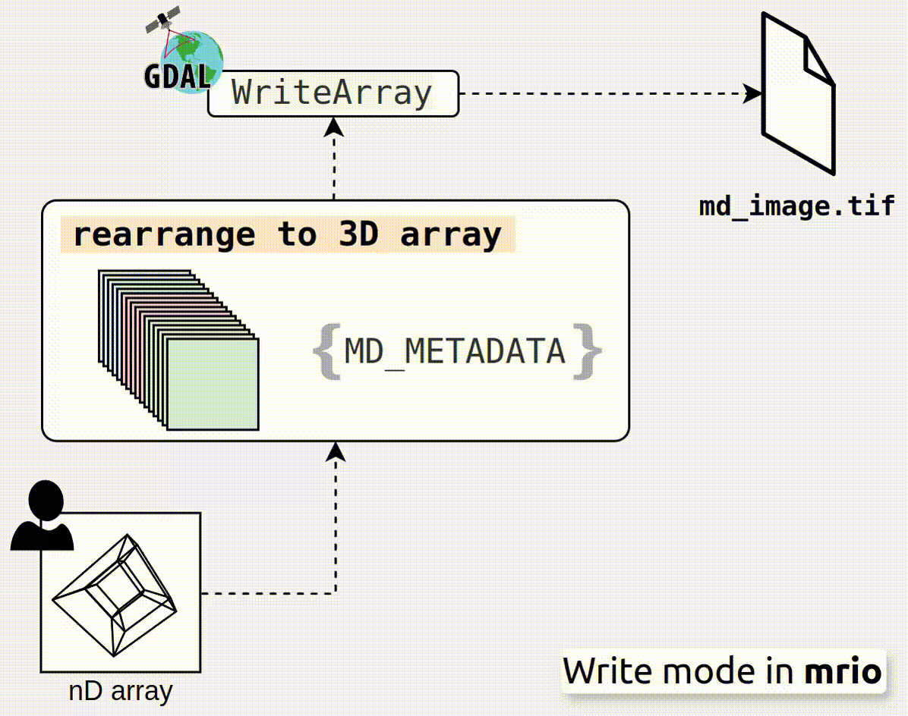
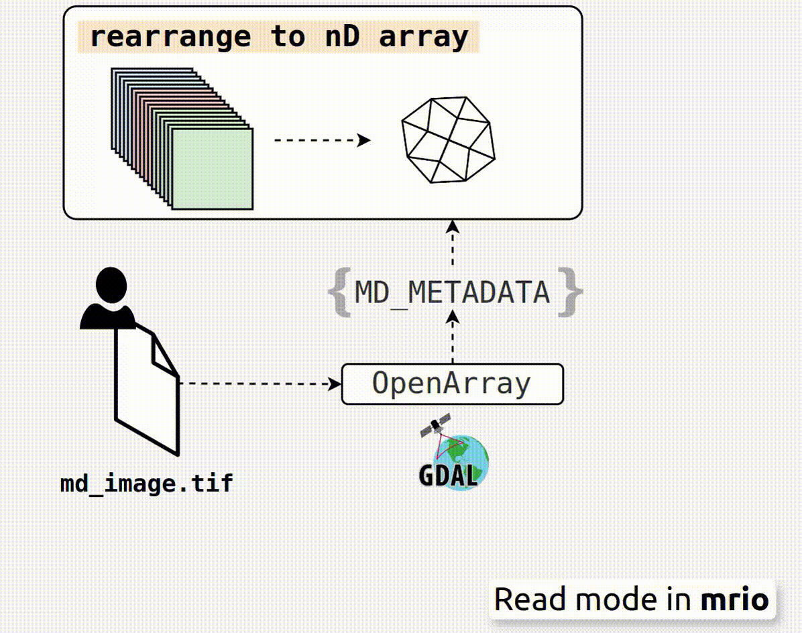

# The Multidimensional GeoTIFF

## Overview

While multidimensional array formats such as NetCDF, HDF5, and Zarr are supported by many GIS software and GDAL, their general-purpose design poses challenges for geospatial interoperability. These formats do not inherently default to explicit metadata conventions, such as coordinate reference systems, spatial dimensions, overviews or temporal attributes. As a result, users often need to manually configure spatial parameters during data ingestion, leading to inconsistent interpretations, projection mismatches, and additional preprocessing steps that complicate geospatial workflows.

The Multidimensional GeoTIFF (mGeoTIFF) specification extends the traditional GeoTIFF format to support N-dimensional arrays. It maintains the simplicity and compatibility of GeoTIFF, offers fast access and the ability to be opened by any GIS software or library that supports the GDALGeoTIFF format.


<figure style="display: flex; flex-direction: column; align-items: center">
  
</figure>


## File format details

This is the version `0.0.1` of the mGeoTIFF specification. From high-level perspective, main difference between a [traditional GeoTIFF](https://docs.ogc.org/is/19-008r4/19-008r4.html) and an mGeoTIFF is the addition of a TAG named as **`MD_METADATA`** that contains the metadata of the multidimensional array.
With this metadata, client libraries can reshape the data from a 3D array (band, x, y) structure to an N-dimensional array.

The `MD_METADATA` tag is embedded within the `TIFFTAG_GDAL_METADATA` ASCII tag (code 42112), as recommended by the [GDAL documentation](https://gdal.org/en/stable/drivers/raster/gtiff.html#metadata) for handling non-standard metadata. This approach ensures compatibility with the GeoTIFF specification while enabling support for multidimensional arrays. The table below highlights the mandatory and optional fields within the `MD_METADATA` JSON structure:

| Field  | Type | Required | Details |
|---|---|---|---|
| md:pattern | string | Yes | A string defining the strategy to reshape the data into a 3D array (band, x, y). It is based on the Einstein-Inspired Notation for OPerationS, einops. The pattern is a space-separated list of dimension names, followed by an arrow `->`, and the new order of the dimensions. For example, `time band y x -> (time band) y x` rearranges the dimensions from `(time, band, y, x)` to `time×band y x`, where `time×band` is a new number of channels. As GeoTIFF define explicitly the `y` and `x` dimensions, the pattern **MUST** always include them. There is no restriction on the number of dimensions. Refer to the [einops paper](https://openreview.net/pdf?id=oapKSVM2bcj) for more details about the notation. |
| md:coordinates | dictionary | Yes | A dictionary defining the coordinates to be combined with the pattern. The values **MUST** be lists of data types compliant with the [JSON standard](https://www.json.org/json-en.html). |
| md:attributes | dictionary | No | A dictionary of additional metadata attributes to include in the file. It **MUST** complies with the [JSON standard](https://www.json.org/json-en.html). |
| md:dimensions | list | No | A list of dimension names, where the order **MUST** align with the order specified in `md:pattern` before the arrow `->`. |
| md:coordinates_len | dictionary | No | A dictionary defining the length of each dimension. The values **MUST** be integers. It is created automatically when it is not provided. |

## Example

The following is an example of the `MD_METADATA` tag in a mGeoTIFF file:

```json
{
  "md:pattern": "time band y x -> (time band) y x",
  "md:coordinates": {
    "time": ["2021-01-01", "2021-01-02", "2021-01-03"],
    "band": ["B01", "B02", "B03"]
  },
  "md:dimensions": ["time", "band", "y", "x"],
  "md:attributes": {
    "title": "Multidimensional GeoTIFF Example",
    "description": "This is a toy example of a Multidimensional GeoTIFF file."
  },
    "md:coordinates_len": {
        "time": 3,
        "band": 3,
        "lat": 100,
        "lon": 100
    }
}
```

## How the I/O works

### Writing

To simplify the explanation of how the I/O works, we will reference the Python API of [mrio](https://github.com/tacofoundation/mrio). When writing an mGeoTIFF file, users must define the `MD_METADATA` tag as a dictionary. This dictionary is validated using Python dataclass fields ([validation details](https://github.com/tacofoundation/mrio-python/blob/main/mrio/fields.py)) and then converted to a JSON string. Refer to the mrio [Python examples](https://https://tacofoundation.github.io/mrio/en/python/examples.html) for guidance on writing an mGeoTIFF file. 

<figure style="display: flex; flex-direction: column; align-items: center">
  
  <figcaption style="text-align: center"><b>Figure 1:</b> Writing an nD Array to a GDAL GeoTIFF Using mrio.</figcaption>
</figure>


By default, all `mrio` files are created as Cloud-Optimized GeoTIFFs (COGs) without overviews. The default creation options are as follows:

```python
creation_options = [
    "COMPRESS=DEFLATE",
    "TILED=YES",
    "BLOCKXSIZE=128",
    "BLOCKYSIZE=128",
    "INTERLEAVE=TILE",
    "BIGTIFF=YES",
    "OVERVIEWS=NONE"
]
```

Arrays of arbitrary dimensions are reshaped into a 3D array (band, y, x) using the `md:pattern` field. With the `INTERLEAVE=TILE` option (check to our post about [COGs](https://https://tacofoundation.github.io/mrio/en/specification/cog.html#file-requirements)), data is compressed into `1 × BLOCKXSIZE × BLOCKYSIZE` tiles and arranged contiguously along the band dimension.

In a 4-D array, the `md:pattern` can be defined in two ways.

- In the case `time band y x -> (time band) y x`, data is stored 
continuously by band within each time step, such as: `b1time1, b2time1, ..., b1time2, b2time2, ..., b1time3, b2time3, ....`

- In the case `time band y x -> (band time) y x`, data is stored 
continuously by time within each band, such as: `b1time1, b1time2, ..., b2time1, b2time2, ..., b3time1, b3time2, ....`

Data providers with large time dimensions (e.g., daily satellite imagery spanning decades) might prefer the band-time interleave layout. This approach ensures temporal byte continuity within the file, enabling efficient retrieval of time-series data. Specifically, requests for any length of time-series data can be fulfilled with just **a single HTTP range request**.

<figure>
  
  <figcaption style="text-align: center"><b>Figure 2: </b>Writing a mGeoTIFF file.</figcaption>
</figure>


By default, `mrio` generates band descriptions following the GDALGeoTIFF convention. These descriptions are stored in the `TIFFTAG_GDAL_METADATA` XML tag. The mrio band descriptions set names based on the `md:coordinates` key-value pairs. For example, given a 5D array with the `md:pattern` of `sim time band y x -> (sim time band) y x`, the resulting band descriptions will be:

```
sim[0]__time[0]__band[0]
sim[0]__time[0]__band[1]
sim[0]__time[0]__band[2]
...
sim[0]__time[1]__band[0]
sim[0]__time[1]__band[1]
sim[0]__time[1]__band[2]
...
sim[1]__time[0]__band[0]
sim[1]__time[0]__band[1]
sim[1]__time[0]__band[2]
...
sim[1]__time[1]__band[0]
sim[1]__time[1]__band[1]
sim[1]__time[1]__band[2]
```

Here, `sim[x]`, `time[y]`, and `band[z]` correspond to the names specified in the `md:coordinates` dictionary. The `__` separator is used to distinguish between dimensions. When dragging and dropping mGeoTIFF files into a GIS software, the band descriptions will be displayed as the band names.


<figure>
  
  <figcaption style="text-align: center"><b>Figure 3: </b>Writing a mGeoTIFF file.</figcaption>
</figure>


### Reading

When reading an mGeoTIFF file, the `mrio` API reconstructs the original multidimensional array 
and metadata by reversing the transformations applied during the writing process. 

<figure style="display: flex; flex-direction: column; align-items: center">
  
  <figcaption style="text-align: center"><b>Figure 4: </b>Reading a GDAL GeoTIFF into an nD Array Using mrio.</figcaption>
</figure>

The reconstruction involves the following steps:

1. **Opening the File**: The file is opened using the GDAL utility, and the `TIFFTAG_GDAL_METADATA` 
tag is accessed to retrieve the `MD_METADATA` JSON string. 

2. **Parsing Metadata**: The `MD_METADATA` string is parsed into a Python dictionary. Key fields, 
such as `md:pattern` and `md:coordinates`, are used to determine how the array should be 
reshaped to restore its original dimensions. Partial reads are supported, by 
[vectorized operations](https://github.com/tacofoundation/mrio-python/blob/708ce05b5cebbf38c2114399ed54c5b4b5769443/mrio/chunk_reader.py#L69).

3. **Creating the Output**: When the `engine` parameter is set to `xarray` (the default), the 
`md:attributes` field is also extracted. This enables the API to construct an `xarray.DataArray` 
object with the associated attributes and coordinates. Numpy rather than xarray is also supported.


<figure>
  
  <figcaption style="text-align: center"><b>Figure 5: </b>Writing a mGeoTIFF file.</figcaption>
</figure>


## FAQ

### Is it supported by QGIS?

If you open a mGeoTIFF file in QGIS, the software will display the special band names that
are generated by `mrio`.

### Is it supported by GDAL?

Not nativelly. However, as mGeoTIFF is a GeoTIFF file, it can be read by GDAL. That is actually
what `mrio` does. It uses GDAL to read the file and then it virtually reshapes the data to the 
original shape.

### Which programming languages are supported?

The `mrio` API is currently available in Python. However, we have plans to support R and Julia 
in the future.

### Can I use it with TensorFlow or PyTorch?

Yes, you can. Actually, we developed `mrio` to be used in our internal deep learning frameworks.

### Why not use NetCDF, HDF5, or Zarr?

::: warning  
**A Personal Perspective:** This reflects our views, not the Image & Signal Processing Group at the 
University of Valencia. Many colleagues (including close friends!) actively advocate 
for [NetCDF](https://www.youtube.com/watch?v=m345_TUjIdI). However, we have yet to find any 
Zarr enthusiasts within our group.
:::

*“Explicit is better than implicit.”* ([The Zen of Python](https://peps.python.org/pep-0020/))  

While there are many existing byte containers for multidimensional arrays, such as NetCDF, HDF5, 
and Zarr, our decision to use GeoTIFF stems from a combination of practical, technical, and 
community-based considerations:

1. **Leverage Existing Tools and Expertise**: There are many byte container formats available online. In theory, one 
could design a multidimensional array format using TIFF by saving 
each n-dimensional chunk in a separate IFD. With some effort, this approach could potentially 
achieve efficiency comparable to other n-dimensional array formats. However, by choosing 
the GDALGeoTIFF/COG layout **all the necessary tools already exist**. GDAL is highly optimized for 
working with COG files and is supported by a large, active community of experts continuously 
improving and maintaining it. Back to the example of an illusional n-D chunked TIFF format, it 
would not only require significant effort to develop but also writing a lot of code to ensure 
compatibility with other software (i.e. QGIS). In practice, the success of a format often depends 
more on the people supporting it than if a format is theoretically better than another.

2. **Stability and Maturity**: GeoTIFF, in particular, has benefited from decades of development 
and refinement, making it a mature and highly stable format. This stability and maturity are key 
factors in its widespread adoption and reliability. One could argue that HDF5 is also "stable." 
However, the key difference lies in its scope, HDF5 is an extremely ambitious project compared 
to GeoTIFF or Zarr. Maintaining its large number of features and extensions is a complex task. Check 
the [HDF5 specification](https://support.hdfgroup.org/documentation/hdf5/latest/_f_m_t3.html) to
give you an idea of the complexity. Breaking changes between minor versions is very common, which 
can disrupt compatibility for software built on top of it, such as NetCDF. This complexity makes 
HDF5 less interoperable, specifically for less experienced users.

3. **Zarr's Promising Yet Nascent Approach**:

Zarr is another general-purpose format, it is relatively new and highly flexible, with a 
clear specification with fewer than 10 pages. In Zarr, almost everything except 
for the datatype, compression, shape, and chunk size is implicit. Instead of being a 
fully self-contained file format, Zarr operates more as a convention for organizing 
n-dimensional arrays in a folder structure. Zarr is cool but it can be very challenging 
to implement in an efficiency manner. Consider the case of a single Sentinel-2 scene 
13x10980x10980 pixels, all the data with overviews included
can be just one COG file. In Zarr, considering the same chunk size, it will be 24037
different files (we are not considering the overviews!). This is extremely inefficient
and very costly in cloud storage. In a HTTP/2 context, GET operations that will cost
1 HTTP request in a COG, will cost hundreds/thousands in Zarr. However, with the introduction 
of sharding ([ZEP 2](https://zarr.dev/zeps/accepted/ZEP0002.html)), which enables chunk parsing,
Zarr can partially solve this problem. Actually the Python [Zarr API](https://github.com/zarr-developers/zarr-python)  
and the other non-official Python [Zarr API](https://github.com/ilan-gold/zarrs-python) already 
support this feature. There are some geospatial initiatives like [GeoZarr](https://github.com/zarr-developers/geozarr-spec) but, 
they are very incipient.

As you can see, there is no perfect format for n-dimensional data. With mGeoTIFF, we aim to
provide a simple, stable, and explicit format for n-dimensional arrays. By building on top the
COG layout. However, there are some drawbacks to this approach that data providers should be aware of:

1. **Hard to apply streaming operations**, especially when user-defined overviews are involved. While not 
technically impossible, implementing streaming in mGeoTIFF is more complex compared to Zarr's chunked 
design, where this process is quite more straightforward.

2. **Limited support for complex nested data structures**. It is not supported to store complex 
nested data structures in mGeoTIFF, like a list of n-dimensional arrays.

3. **Imposible to extent the chunking schema**. In mGeoTIFF, the chunking schema is 
dimension fixed. This means that if you have a 4D array, you can only define the chunking schema
as (1 x 1 x BLOCKXSIZE x BLOCKYSIZE) or (1 x C x BLOCKXSIZE x BLOCKYSIZE) if pixel interleave is
used. Chunking schema is a natural feature in Zarr or NetCDF5. This limitation is critical 
because it will make larger in size with respect to Zarr or NetCDF5, specially when tehre is a lot
of redundancy in the data.

Despite these limitations, we believe that multidimensional GeoTIFF is currently the best option 
for many use cases. Whether you are creating a web map to visualize 10 years of changes in your 
village or building a deep learning dataset with multitemporal samples, mGeoTIFF provides a 
robust, mature, and reliable solution.
